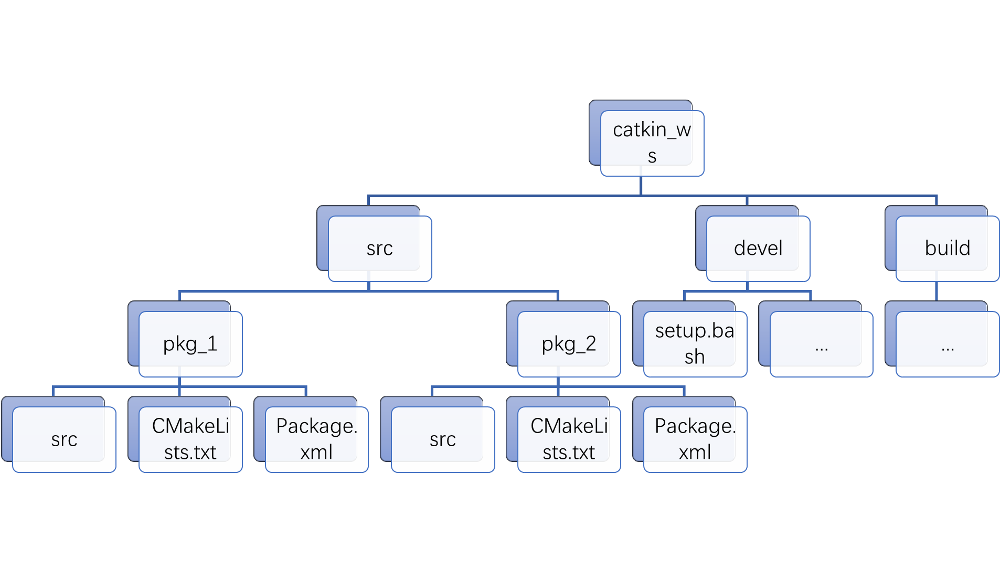

# 中国矿业大学人工智能系统专业实践课程

[](http://wiki.ros.org/noetic)
[](https://ubuntu.com/)
[](https://www.python.org/)
[](LICENSE)
[](https://github.com/Post-b)

---

## 📘 项目简介
本项目为 **中国矿业大学人工智能系统专业实践课程笔记与实验参考资料**。  
主要包含 ROS 系统实验环境搭建、依赖安装方法、以及课程相关实验代码。

> ⚙️ **推荐环境：**
> - Ubuntu 18.04 + ROS Melodic（实验课老师推荐）  
> - 若使用 Ubuntu 20.04 + ROS Noetic，在安装 `turtlebot2` 时可能出现依赖包缺失问题。  
>   本项目的 `catkin_ws/src` 文件夹中提供了完整的依赖和实验代码以供参考。

---

## 🔧 环境配置与依赖安装

ROS-Noetic 下安装 `turtlebot2` 可参考以下教程：  
👉 [安装参考链接（CSDN）](https://blog.csdn.net/weixin_44999897/article/details/128377100?fromshare=blogdetail&sharetype=blogdetail&sharerId=128377100&sharerefer=PC&sharesource=2301_79006769&sharefrom=from_link)

> ⚠️ **提示：**
> - 若不使用 VPN 下载 GitHub 依赖，可能出现项目缺失。  
> - 可直接使用本项目 `catkin_ws/src` 文件夹中提供的依赖与实验包。

---

## 🧩 实验结构与步骤

### 1️⃣ 工作空间结构
在 Linux 终端中打开 `catkin_ws`（或你自定义命名的工作空间）文件夹。  
所有实验代码需放置在 `catkin_ws/src` 目录下，例如：



> 图示中 `pkg_1`、`pkg_2` 分别表示不同实验对应的功能包。

---

### 2️⃣ 编译与运行

每次实验完成后，需要在 `catkin_ws` 目录下执行以下命令：

```bash
catkin_make
source devel/setup.bash
rosrun <pkg_name> <node_name>
````

例如：

```bash
cd ./catkin_ws
catkin_make
source devel/setup.bash
rosrun test01 test_01
```

此时你即可在 ROS 中发布话题，运行实验节点。

---

### 3️⃣ ROS 文件结构说明

| 文件夹/文件             | 说明                                                              |
| ------------------ | --------------------------------------------------------------- |
| **src/**           | 源代码空间，所有 ROS 包放在此处。                                             |
| **build/**         | 编译空间，`catkin_make` 生成的中间文件、缓存、日志存放于此。无需手动修改。                    |
| **devel/**         | 开发空间，保存编译生成的可执行文件、库文件、头文件等。通过 `source devel/setup.bash` 激活当前环境。 |
| **CMakeLists.txt** | Catkin/CMake 的构建配置文件，定义包依赖、编译规则与安装目标。                           |
| **package.xml**    | 包的元信息文件，定义包名、版本、作者、依赖等信息。                                       |

---

### 4️⃣ ROS 核心概念回顾

* ROS 的核心思想是 **节点（Node）之间的通信**。
* 每个节点通常是一个独立的可执行文件。
* 功能相近的节点、库、配置文件会被打包为一个 **功能包（Package）**。
* ROS 使用 **Catkin** 作为构建系统（基于 CMake），通过 `catkin_make` 管理项目编译与依赖。

---

## ✅ 推荐项目结构

```
catkin_ws/
├── src/
│   ├── pkg_1/
│   ├── pkg_2/
│   └── ...
├── build/
├── devel/
└── CMakeLists.txt
```

---

## 📎 附加说明

若在安装或运行中出现依赖缺失，可：

* 检查是否正确执行 `source devel/setup.bash`
* 参考博客教程重新安装
* 使用本仓库提供的 `catkin_ws/src` 完整依赖包

---

## 📫 维护者信息

**Maintainer:** [Post-b](https://github.com/Post-b)
**License:** MIT
**Repository:** [CUMT AI System Practice](https://github.com/Post-b/CUMT_AI_ROS)

---

🧠 *本项目旨在帮助同学们快速理解 ROS 实践流程，规范实验文件结构与运行方法。*

